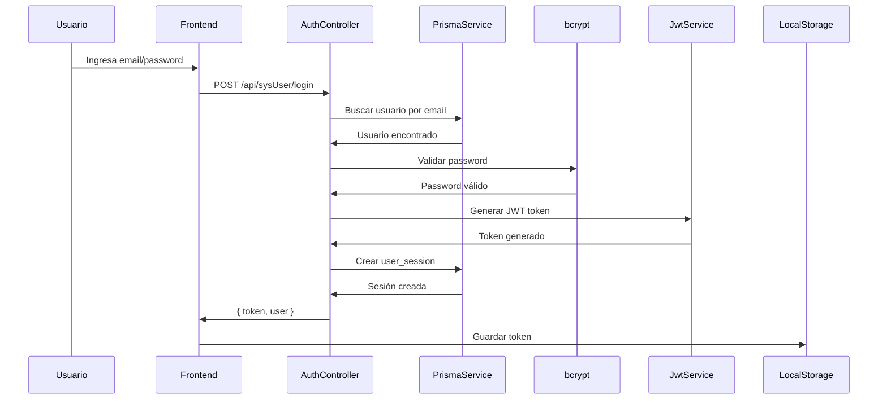
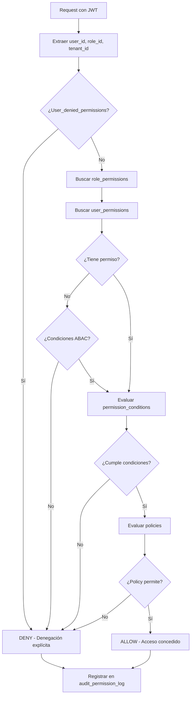
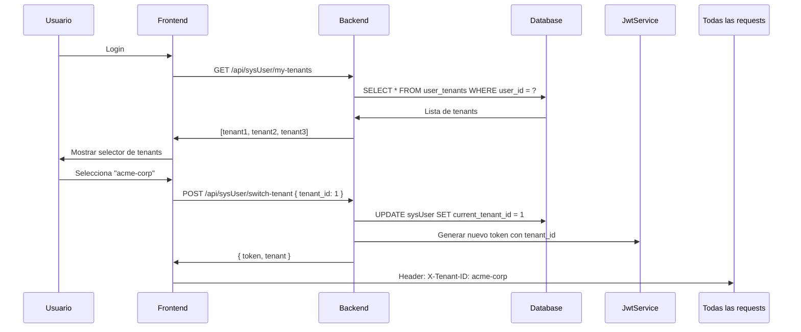

# 📊 Guía Completa del Schema Prisma - Sistema GALATEA

> **Última actualización**: 27 de enero de 2026
> **Base de datos**: PostgreSQL (`galatea`)
> **ORM**: Prisma 6.6.0

---

## 🏗️ Arquitectura General

El sistema GALATEA es un **framework multi-tenant SaaS empresarial** con arquitectura modular que incluye:

- **Multi-tenancy nativo**: Campo `tenant_ids[]` en todas las tablas
- **Sistema de permisos híbrido** (RBAC + ABAC)
- **Gestión de organizaciones y equipos jerárquicos**
- **Sistema de agentes IA versionados**
- **Mensajería multi-canal** (Email, SMS, WhatsApp, Push)
- **Auditoría completa** de todas las operaciones
- **WebSockets** para comunicación en tiempo real
- **Feature flags** para despliegues graduales
- **Sistema de webhooks** con idempotencia

---

## 📑 Índice

1. [Sistema de Autenticación y Usuarios](#1-sistema-de-autenticación-y-usuarios)
2. [Sistema Multi-Tenant](#2-sistema-multi-tenant)
3. [Sistema de Permisos (RBAC + ABAC)](#3-sistema-de-permisos-rbac--abac)
4. [Sistema de Organizaciones y Equipos](#4-sistema-de-organizaciones-y-equipos)
5. [Sistema de Agentes IA](#5-sistema-de-agentes-ia)
6. [Sistema de Mensajería](#6-sistema-de-mensajería)
7. [Sistema de Pagos](#7-sistema-de-pagos)
8. [Sistema WebSocket](#8-sistema-websocket)
9. [Sistema de Auditoría](#9-sistema-de-auditoría)
10. [Seguridad](#10-seguridad)
11. [Datos Geográficos](#11-datos-geográficos)
12. [⚙️ Configuración y Features (DETALLADO)](#12-️-configuración-y-features-detallado)
13. [Flujos Principales](#13-flujos-principales)
14. [Patrones de Diseño](#14-patrones-de-diseño)

---

## 1. Sistema de Autenticación y Usuarios

### **sysUser** (Tabla Central)

Tabla principal de usuarios del sistema con soporte multi-tenant.

```prisma
model sysUser {
  idsysUser                   Int       @id @default(autoincrement())
  userName                    String?   @db.VarChar(100)
  userLastName                String?   @db.VarChar(100)
  userEmail                   String    @unique @db.VarChar(100)
  userPhone                   String?   @db.VarChar(45)
  userPassword                String    @db.VarChar(255)  // bcrypt hash
  role_idrole                 Int?
  user_status_iduser_status   Int?
  userPhoto                   String?   @db.VarChar(500)
  metadata                    Json?
  created_at                  DateTime? @default(now())
  updated_at                  DateTime? @default(now())
  last_login                  DateTime?
  tenant_ids                  String[]  @default(["development"])
  current_organization_id     Int?
  current_team_id             Int?
  is_active                   Boolean?  @default(true)
  activation_token            String?   @db.VarChar(255)
  activation_expires          DateTime?
  reset_password_token        String?   @db.VarChar(255)
  reset_password_expires      DateTime?
  uuid                        String    @unique @default(dbgenerated("gen_random_uuid()"))
}
```

**Campos clave**:
- `userPassword`: Hash bcrypt con salt rounds configurables
- `tenant_ids[]`: Array de tenants a los que pertenece el usuario
- `uuid`: Identificador UUID para referencias externas
- `activation_token`: Token temporal para activación de cuenta (email)
- `reset_password_token`: Token temporal para reset de contraseña
- `metadata`: Datos adicionales en JSON (preferencias, configuración, etc.)

**Relaciones**:
```typescript
sysUser → role (rol asignado)
sysUser → user_status (estado del usuario)
sysUser → organizations (organización actual)
sysUser → teams (equipo actual)
sysUser → user_tenants[] (relación muchos-a-muchos con tenants)
sysUser → user_organizations[] (organizaciones a las que pertenece)
sysUser → user_teams[] (equipos a los que pertenece)
sysUser → user_sessions[] (sesiones activas)
```

---

### **user_status**

Estados posibles del usuario en el sistema.

```prisma
model user_status {
  iduser_status Int      @id @default(autoincrement())
  description   String   @unique @db.VarChar(45)
  tenant_ids    String[] @default(["development"])
}
```

**Estados comunes**:
- `active`: Usuario activo y operativo
- `inactive`: Usuario desactivado temporalmente
- `suspended`: Usuario suspendido por violación de políticas
- `pending_activation`: Usuario registrado pero no activado
- `locked`: Usuario bloqueado por intentos fallidos de login

---

### **user_sessions**

Gestión de sesiones JWT con soporte multi-dispositivo.

```prisma
model user_sessions {
  id            Int       @id @default(autoincrement())
  user_id       Int
  session_token String    @unique @db.VarChar(500)  // JWT token
  refresh_token String?   @unique @db.VarChar(500)  // Refresh token
  ip_address    String?   @db.Inet
  user_agent    String?   // Navegador/dispositivo
  device_info   Json?     // Información detallada del dispositivo
  is_active     Boolean?  @default(true)
  last_activity DateTime? @default(now())
  created_at    DateTime? @default(now())
  expires_at    DateTime  // Expiración del token
  tenant_ids    String[]  @default(["development"])
}
```

**Funcionalidades**:
- **Multi-dispositivo**: Un usuario puede tener múltiples sesiones activas
- **Tracking de dispositivos**: `user_agent` y `device_info` para identificación
- **Seguridad**: IP tracking para detección de accesos sospechosos
- **Auto-logout**: `expires_at` para invalidación automática
- **Refresh tokens**: Renovación de tokens sin re-login

**Ejemplo de device_info**:
```json
{
  "browser": "Chrome",
  "version": "120.0",
  "os": "Windows",
  "device_type": "desktop",
  "screen_resolution": "1920x1080"
}
```

---

## 2. Sistema Multi-Tenant

### **tenants** (Tabla Maestra)

Tabla centralizada para gestión de tenants (inquilinos) del sistema.

```prisma
model tenants {
  id          Int      @id @default(autoincrement())
  tenant_sub  String   @unique @default(dbgenerated("gen_random_uuid()"))
  slug        String   @unique @db.VarChar(100)  // URL-friendly
  name        String   @db.VarChar(255)
  description String?
  is_active   Boolean  @default(true)
  metadata    Json?
  created_at  DateTime @default(now())
  updated_at  DateTime @default(now())
}
```

**Campos**:
- `tenant_sub`: UUID único generado automáticamente (inmutable)
- `slug`: Identificador legible para URLs (ej: `acme-corp`, `galatea-dev`)
- `metadata`: Configuración específica del tenant

**Ejemplo de metadata**:
```json
{
  "billing_plan": "enterprise",
  "max_users": 100,
  "features": ["analytics", "ai_agents", "custom_branding"],
  "custom_domain": "app.acme-corp.com",
  "theme": {
    "primary_color": "#1a73e8",
    "logo_url": "https://cdn.acme-corp.com/logo.png"
  }
}
```

---

### **user_tenants** (Relación Usuario-Tenant)

Tabla de unión muchos-a-muchos entre usuarios y tenants.

```prisma
model user_tenants {
  id             Int      @id @default(autoincrement())
  user_id        Int
  tenant_id      Int
  is_default     Boolean  @default(false)  // Tenant por defecto del usuario
  role_in_tenant String?  @db.VarChar(100) // Rol específico en este tenant
  permissions    Json?    // Permisos adicionales específicos
  assigned_at    DateTime @default(now())
  assigned_by    Int?     // Usuario que asignó
  is_active      Boolean  @default(true)
}
```

**Flujo de trabajo**:
1. Usuario se registra o es invitado a un tenant
2. Se crea registro en `user_tenants` con `is_default = true` (primer tenant)
3. Usuario puede cambiar de tenant activo via `switchTenant()`
4. Todas las queries filtran automáticamente por `tenant_id` actual

**Ejemplo**:
```typescript
// Usuario pertenece a 3 tenants
user_tenants: [
  { tenant_id: 1, slug: "acme-corp", is_default: true, role: "admin" },
  { tenant_id: 5, slug: "galatea-dev", is_default: false, role: "developer" },
  { tenant_id: 12, slug: "client-xyz", is_default: false, role: "viewer" }
]
```

---

## 3. Sistema de Permisos (RBAC + ABAC)

Sistema híbrido que combina:
- **RBAC**: Role-Based Access Control (permisos por rol)
- **ABAC**: Attribute-Based Access Control (permisos por atributos/condiciones)

---

### **role** (Roles)

```prisma
model role {
  idrole          Int       @id @default(autoincrement())
  rolename        String    @unique @db.VarChar(100)
  parent_role_id  Int?      // Herencia de roles
  priority        Int?      @default(0)
  is_system_role  Boolean?  @default(false)
  level           String?   @default("tenant") @db.VarChar(50)
  description     String?
  metadata        Json?
  created_at      DateTime? @default(now())
  updated_at      DateTime? @default(now())
  tenant_ids      String[]  @default(["development"])
}
```

**Niveles de roles**:
- `system`: Roles del sistema (super_admin, system_manager)
- `tenant`: Roles a nivel tenant (admin, manager)
- `organization`: Roles a nivel organización (org_admin)
- `team`: Roles a nivel equipo (team_lead)

**Herencia de roles**:
```typescript
// Ejemplo de jerarquía
super_admin (priority: 100, parent: null)
  └─ admin (priority: 80, parent: super_admin)
      └─ manager (priority: 60, parent: admin)
          └─ user (priority: 40, parent: manager)
              └─ guest (priority: 20, parent: user)
```

Roles hijos heredan permisos de roles padres automáticamente.

---

### **permission_definition** (Definiciones de Permisos)

```prisma
model permission_definition {
  id          Int       @id @default(autoincrement())
  code        String    @unique @db.VarChar(255)  // "users:create"
  resource    String    @db.VarChar(100)          // "users"
  action      String    @db.VarChar(50)           // "create"
  scope       String?   @db.VarChar(50)           // "global", "organization", "team", "own"
  level       String?   @default("system")        // "system", "tenant", "organization", "team"
  description String?
  metadata    Json?
  is_active   Boolean?  @default(true)
  created_at  DateTime? @default(now())
  updated_at  DateTime? @default(now())
  tenant_ids  String[]  @default(["development"])
  module_id   Int?      // Módulo al que pertenece
  action_id   Int?      // Acción específica
}
```

**Formato de código**: `{resource}:{action}:{scope?}`

**Ejemplos**:
```typescript
"users:create:global"       // Crear usuarios en todo el sistema
"users:read:organization"   // Leer usuarios de la organización
"users:update:team"         // Actualizar usuarios del equipo
"users:delete:own"          // Eliminar solo propios usuarios
"orders:approve:all"        // Aprobar cualquier orden
"reports:export:own"        // Exportar solo reportes propios
```

---

### **modules** (Módulos del Sistema)

Organización jerárquica de módulos para gestión de permisos.

```prisma
model modules {
  id               Int       @id @default(autoincrement())
  name             String    @db.VarChar(100)
  code             String    @unique @db.VarChar(100)
  description      String?
  icon             String?   @db.VarChar(100)  // Material icon name
  parent_module_id Int?      // Jerarquía de módulos
  sort_order       Int?      @default(0)
  is_active        Boolean?  @default(true)
  metadata         Json?
  created_at       DateTime? @default(now())
  updated_at       DateTime? @default(now())
  tenant_ids       String[]  @default(["development"])
}
```

**Ejemplo de jerarquía**:
```typescript
// Módulo raíz
{
  code: "administration",
  name: "Administración",
  icon: "settings",
  parent_module_id: null
}
  // Submódulos
  └─ {
      code: "user-management",
      name: "Gestión de Usuarios",
      icon: "people",
      parent_module_id: 1
    }
  └─ {
      code: "role-management",
      name: "Gestión de Roles",
      icon: "security",
      parent_module_id: 1
    }
```

---

### **actions** (Acciones Disponibles)

```prisma
model actions {
  id                Int       @id @default(autoincrement())
  name              String    @db.VarChar(100)
  code              String    @unique @db.VarChar(100)
  description       String?
  requires_ownership Boolean?  @default(false)
  is_system_action  Boolean?  @default(false)
  sort_order        Int?      @default(0)
  is_active         Boolean?  @default(true)
  metadata          Json?
  created_at        DateTime? @default(now())
  updated_at        DateTime? @default(now())
  tenant_ids        String[]  @default(["development"])
}
```

**Acciones estándar**:
```typescript
{ code: "create",  name: "Crear",      requires_ownership: false }
{ code: "read",    name: "Leer",       requires_ownership: false }
{ code: "update",  name: "Actualizar", requires_ownership: false }
{ code: "delete",  name: "Eliminar",   requires_ownership: false }
{ code: "approve", name: "Aprobar",    requires_ownership: false }
{ code: "export",  name: "Exportar",   requires_ownership: true }
{ code: "share",   name: "Compartir",  requires_ownership: true }
```

---

### **Relaciones de Permisos**

#### **role_permissions** (Permisos del Rol)

```prisma
model role_permissions {
  id            Int       @id @default(autoincrement())
  role_id       Int
  permission_id Int
  granted_by    Int?      // Usuario que otorgó el permiso
  granted_at    DateTime? @default(now())
  tenant_ids    String[]  @default(["development"])
}
```

Asigna permisos a un rol completo. Todos los usuarios con ese rol heredan estos permisos.

---

#### **user_permissions** (Permisos Directos de Usuario)

```prisma
model user_permissions {
  id            Int       @id @default(autoincrement())
  user_id       Int
  permission_id Int
  resource_id   String?   @db.VarChar(100)  // ID específico del recurso
  granted_by    Int?
  granted_at    DateTime? @default(now())
  expires_at    DateTime? // Permiso temporal
  tenant_ids    String[]  @default(["development"])
}
```

**Casos de uso**:
```typescript
// Permiso temporal para aprobar orden específica
{
  user_id: 42,
  permission_id: 15, // "orders:approve"
  resource_id: "order_12345",
  expires_at: "2026-02-01T00:00:00Z"
}

// Permiso permanente para gestionar proyecto específico
{
  user_id: 42,
  permission_id: 8, // "projects:manage"
  resource_id: "project_99",
  expires_at: null
}
```

---

#### **user_denied_permissions** (Denegaciones Explícitas)

```prisma
model user_denied_permissions {
  id            Int       @id @default(autoincrement())
  user_id       Int
  permission_id Int
  resource_id   String?   @db.VarChar(100)
  reason        String?   // Motivo de denegación
  denied_by     Int?
  denied_at     DateTime? @default(now())
  expires_at    DateTime? // Denegación temporal
  tenant_ids    String[]  @default(["development"])
}
```

**Prioridad**: Las denegaciones explícitas tienen **mayor prioridad** que los permisos otorgados.

**Ejemplo**:
```typescript
// Usuario tiene rol "manager" con permiso "users:delete"
// Pero se le deniega específicamente eliminar usuario 7
{
  user_id: 42,
  permission_id: 5, // "users:delete"
  resource_id: "7",
  reason: "Usuario protegido - fundador de la empresa",
  denied_by: 1
}
```

---

### **permission_conditions** (Condiciones ABAC)

```prisma
model permission_conditions {
  id               Int      @id @default(autoincrement())
  permission_id    Int
  field            String   @db.VarChar(255)  // Campo a evaluar
  operator         String   @db.VarChar(50)   // Operador de comparación
  value            Json                        // Valor a comparar
  condition_type   String?  @default("user")  // "user" | "resource" | "context"
  logical_operator String?  @default("AND")   // "AND" | "OR"
  priority         Int?     @default(0)
  tenant_ids       String[] @default(["development"])
}
```

**Operadores soportados**:
- `equals`: Igualdad exacta
- `not_equals`: Diferente de
- `in`: Está en array
- `not_in`: No está en array
- `gt`: Mayor que
- `gte`: Mayor o igual que
- `lt`: Menor que
- `lte`: Menor o igual que
- `contains`: Contiene substring
- `starts_with`: Comienza con
- `ends_with`: Termina con
- `matches_regex`: Coincide con expresión regular

**Ejemplos de condiciones**:

```typescript
// Solo puede editar sus propios registros
{
  permission_id: 10, // "orders:update"
  field: "owner_id",
  operator: "equals",
  value: "{{user.id}}",
  condition_type: "resource"
}

// Solo puede aprobar órdenes menores a $1000
{
  permission_id: 15, // "orders:approve"
  field: "amount",
  operator: "lt",
  value: 1000,
  condition_type: "resource"
}

// Solo puede acceder en horario laboral
{
  permission_id: 8, // "reports:export"
  field: "hour",
  operator: "gte",
  value: 9,
  condition_type: "context",
  logical_operator: "AND"
},
{
  permission_id: 8,
  field: "hour",
  operator: "lt",
  value: 18,
  condition_type: "context",
  logical_operator: "AND"
}

// Solo puede acceder desde IPs corporativas
{
  permission_id: 20, // "admin:access"
  field: "ip_address",
  operator: "in",
  value: ["192.168.1.0/24", "10.0.0.0/8"],
  condition_type: "context"
}
```

---

### **policies** (Políticas de Acceso)

```prisma
model policies {
  id          Int       @id @default(autoincrement())
  name        String    @unique @db.VarChar(255)
  description String?
  resource    String?   @db.VarChar(100)
  effect      String?   @default("allow")  // "allow" | "deny"
  priority    Int?      @default(0)
  is_active   Boolean?  @default(true)
  created_at  DateTime? @default(now())
  updated_at  DateTime? @default(now())
  tenant_ids  String[]  @default(["development"])
}
```

**Políticas**: Reglas de negocio complejas que pueden permitir o denegar acceso.

**Ejemplo**:
```typescript
{
  name: "restrict_after_hours_access",
  resource: "financial_reports",
  effect: "deny",
  priority: 100,
  policy_rules: [
    {
      field: "hour",
      operator: "lt",
      value: 6,
      logical_operator: "OR"
    },
    {
      field: "hour",
      operator: "gte",
      value: 22,
      logical_operator: "OR"
    }
  ]
}
```

---

## 4. Sistema de Organizaciones y Equipos

### **organizations**

```prisma
model organizations {
  id          Int       @id @default(autoincrement())
  name        String    @db.VarChar(255)
  code        String    @unique @db.VarChar(100)
  description String?
  logo        String?   @db.VarChar(500)
  metadata    Json?
  is_active   Boolean?  @default(true)
  created_at  DateTime? @default(now())
  updated_at  DateTime? @default(now())
  tenant_ids  String[]  @default(["development"])
}
```

---

### **teams**

```prisma
model teams {
  id              Int       @id @default(autoincrement())
  name            String    @db.VarChar(255)
  code            String    @db.VarChar(100)
  organization_id Int?
  parent_team_id  Int?      // Equipos anidados
  description     String?
  metadata        Json?
  is_active       Boolean?  @default(true)
  created_at      DateTime? @default(now())
  updated_at      DateTime? @default(now())
  tenant_ids      String[]  @default(["development"])
}
```

**Jerarquía de equipos**:
```typescript
Engineering (parent: null)
  ├─ Frontend Team (parent: Engineering)
  │   ├─ React Team (parent: Frontend)
  │   └─ Vue Team (parent: Frontend)
  └─ Backend Team (parent: Engineering)
      ├─ API Team (parent: Backend)
      └─ Database Team (parent: Backend)
```

---

### **user_organizations**

```prisma
model user_organizations {
  id              Int       @id @default(autoincrement())
  user_id         Int
  organization_id Int
  is_primary      Boolean?  @default(false)
  joined_at       DateTime? @default(now())
  tenant_ids      String[]  @default(["development"])
}
```

---

### **user_teams**

```prisma
model user_teams {
  id         Int       @id @default(autoincrement())
  user_id    Int
  team_id    Int
  is_leader  Boolean?  @default(false)
  joined_at  DateTime? @default(now())
  tenant_ids String[]  @default(["development"])
}
```

---

### **generic_records** (Recursos Genéricos)

```prisma
model generic_records {
  id              Int       @id @default(autoincrement())
  name            String    @db.VarChar(255)
  description     String?
  owner_id        Int?
  team_id         Int?
  organization_id Int?
  is_public       Boolean?  @default(false)
  created_at      DateTime? @default(now())
  updated_at      DateTime? @default(now())
  tenant_ids      String[]  @default(["development"])
}
```

**Jerarquía de visibilidad**:
1. **Public** (`is_public = true`): Visible para todos en el tenant
2. **Organization** (`organization_id`): Visible para todos en la organización
3. **Team** (`team_id`): Visible para todos en el equipo
4. **Owner** (`owner_id`): Visible solo para el propietario

---

## 5. Sistema de Agentes IA

### **agent**

```prisma
model agent {
  idagent                     Int      @id @default(autoincrement())
  agentName                   String   @unique @db.VarChar(100)
  description                 String?
  agent_status_idagent_status Int
  configuration               Json?
  metadata                    Json?
  tenant_ids                  String[] @default(["development"])
}
```

**Ejemplo de configuration**:
```json
{
  "model": "gpt-4-turbo",
  "temperature": 0.7,
  "max_tokens": 2000,
  "system_prompt": "Eres un asistente especializado en...",
  "tools": ["web_search", "code_interpreter", "image_generation"]
}
```

---

### **agent_version**

```prisma
model agent_version {
  idagent_version Int      @id @default(autoincrement())
  version         String   @db.VarChar(45)
  description     String?
  agent_idagent   Int
  isActive        Boolean? @default(false)
  isDefault       Boolean? @default(false)
  configuration   Json?
  tenant_ids      String[] @default(["development"])
}
```

**Versionado**:
```typescript
// Agente "Customer Support AI"
agent_version: [
  { version: "1.0.0", isActive: false, isDefault: false }, // Versión legacy
  { version: "2.0.0", isActive: true,  isDefault: false }, // Versión en testing
  { version: "2.1.0", isActive: true,  isDefault: true  }  // Versión actual
]
```

---

### **role_has_agent_version**

```prisma
model role_has_agent_version {
  id                            Int @id @default(autoincrement())
  role_idrole                   Int
  agent_version_idagent_version Int
  tenant_ids                    String[] @default(["development"])
}
```

Control de acceso a versiones específicas de agentes por rol.

---

## 6. Sistema de Mensajería

### **messaging**

```prisma
model messaging {
  idmessaging    Int       @id @default(autoincrement())
  fromIdentifier String?   @db.VarChar(255)
  toIdentifier   String?   @db.VarChar(255)
  messageBody    String?
  messageDate    DateTime? @default(now())
  direction      String?   @db.VarChar(20)  // "inbound" | "outbound"
  channel        String?   @db.VarChar(50)  // "email" | "sms" | "whatsapp" | "push"
  status         String?   @db.VarChar(50)
  metadata       Json?
  tenant_ids     String[]  @default(["development"])
}
```

**Canales soportados**:
- `email`: Correo electrónico (Gmail, SendGrid)
- `sms`: Mensajes de texto (Twilio)
- `whatsapp`: WhatsApp Business API
- `push`: Notificaciones push (FCM, APNS)

---

### **messagelogs**

```prisma
model messagelogs {
  id            Int       @id @default(autoincrement())
  channel       String    @db.VarChar(50)
  recipient     String    @db.VarChar(255)
  subject       String?   @db.VarChar(255)
  body          String?
  status        String?   @db.VarChar(50)  // "sent" | "failed" | "pending" | "delivered"
  error_message String?
  metadata      Json?
  sent_at       DateTime? @default(now())
  tenant_ids    String[]  @default(["development"])
}
```

**Estados de mensajes**:
- `pending`: En cola de envío
- `sent`: Enviado correctamente
- `delivered`: Entregado al destinatario
- `failed`: Falló el envío
- `bounced`: Rebotado (email)
- `rejected`: Rechazado por proveedor

---

## 7. Sistema de Pagos

### **transaction**

```prisma
model transaction {
  idtransaction                         Int            @id @default(autoincrement())
  transactionDate                       DateTime?      @default(now())
  amount                                Decimal        @db.Decimal(12, 2)
  currency                              String?        @default("USD")
  paymentType_idpaymentType             Int?
  transactionStatus_idtransactionStatus Int?
  reference_id                          String?        @db.VarChar(255)
  stripe_payment_intent_id              String?        @db.VarChar(255)
  stripe_charge_id                      String?        @db.VarChar(255)
  reference_number                      String?        @db.VarChar(100)
  metadata                              Json?
  notes                                 String?
  tenant_ids                            String[]       @default(["development"])
}
```

---

### **stripe_connect_accounts**

```prisma
model stripe_connect_accounts {
  id                Int       @id @default(autoincrement())
  stripe_account_id String    @unique @db.VarChar(255)
  account_type      String?   @db.VarChar(50)  // "standard" | "express" | "custom"
  entity_id         Int?      // ID del restaurant, merchant, etc.
  entity_type       String?   @db.VarChar(100) // "restaurant" | "merchant"
  email             String?   @db.VarChar(255)
  business_name     String?   @db.VarChar(255)
  country           String?   @db.VarChar(2)   // ISO code
  currency          String?   @db.VarChar(3)   // USD, EUR, etc.
  charges_enabled   Boolean?  @default(false)
  payouts_enabled   Boolean?  @default(false)
  details_submitted Boolean?  @default(false)
  metadata          Json?
  created_at        DateTime? @default(now())
  updated_at        DateTime? @default(now())
  tenant_ids        String[]  @default(["development"])
}
```

---

## 8. Sistema WebSocket

### **websocket_connections**

```prisma
model websocket_connections {
  id              Int       @id @default(autoincrement())
  socket_id       String    @unique @db.VarChar(255)
  user_id         Int?
  entity_id       Int?      // ID de la entidad conectada (opcional)
  entity_type     String?   @db.VarChar(100)  // "user" | "agent" | "device"
  connected_at    DateTime? @default(now())
  disconnected_at DateTime? // Null mientras está conectado
  tenant_ids      String[]  @default(["development"])
}
```

**Uso**: Tracking de conexiones activas para:
- Notificaciones en tiempo real
- Presencia de usuarios online
- Chat en vivo
- Actualizaciones de dashboard en tiempo real
- Sistema de agentes IA (GALATEA)

---

## 9. Sistema de Auditoría

### **audit_permission_log**

```prisma
model audit_permission_log {
  id                Int       @id @default(autoincrement())
  user_id           Int?
  permission_code   String?   @db.VarChar(255)
  resource_type     String?   @db.VarChar(100)
  resource_id       String?   @db.VarChar(100)
  action            String?   @db.VarChar(50)
  result            String?   @db.VarChar(20)  // "allowed" | "denied"
  reason            String?   // Motivo del resultado
  ip_address        String?   @db.Inet
  user_agent        String?
  request_id        String?   @db.VarChar(100)
  execution_time_ms Int?      // Tiempo de evaluación en ms
  metadata          Json?
  created_at        DateTime? @default(now())
  tenant_ids        String[]  @default(["development"])
}
```

**Ejemplo de log**:
```json
{
  "user_id": 42,
  "permission_code": "orders:approve",
  "resource_type": "order",
  "resource_id": "12345",
  "action": "approve",
  "result": "denied",
  "reason": "User does not have permission for orders over $1000",
  "ip_address": "192.168.1.100",
  "execution_time_ms": 23
}
```

---

### **audit_deletions**

```prisma
model audit_deletions {
  id           Int       @id @default(autoincrement())
  table_name   String?   @db.VarChar(100)
  record_id    String?   @db.VarChar(50)
  deleted_data Json?     // Snapshot completo del registro eliminado
  deleted_at   DateTime? @default(now())
  deleted_by   String?   @default(dbgenerated("CURRENT_USER"))
  client_ip    String?   @default(dbgenerated("inet_client_addr()"))
  session_pid  Int?      @default(dbgenerated("pg_backend_pid()"))
  tenant_ids   String[]  @default(["development"])
}
```

**Uso**: Recuperación de datos eliminados accidentalmente.

---

## 10. Seguridad

### **api_keys**

```prisma
model api_keys {
  id           Int       @id @default(autoincrement())
  user_id      Int?
  key_hash     String    @unique @db.VarChar(255)  // bcrypt hash
  key_prefix   String    @db.VarChar(20)           // "pk_live_..."
  name         String?   @db.VarChar(255)
  scopes       String[]  // Alcances permitidos
  rate_limit   Int?      // Requests por minuto
  is_active    Boolean?  @default(true)
  last_used_at DateTime?
  created_at   DateTime? @default(now())
  expires_at   DateTime?
  tenant_ids   String[]  @default(["development"])
}
```

**Ejemplo de scopes**:
```typescript
scopes: [
  "users:read",
  "orders:read",
  "orders:create",
  "reports:read"
]
```

---

### **ip_blacklist / ip_whitelist**

```prisma
model ip_blacklist {
  id         Int       @id @default(autoincrement())
  ip_address String    @db.Inet
  cidr_range String?   @db.VarChar(50)  // "192.168.1.0/24"
  reason     String?
  blocked_by Int?
  is_active  Boolean?  @default(true)
  created_at DateTime? @default(now())
  expires_at DateTime?
  tenant_ids String[]  @default(["development"])
}
```

---

### **rate_limit_log**

```prisma
model rate_limit_log {
  id              Int       @id @default(autoincrement())
  identifier      String    @db.VarChar(255)  // IP, user_id, api_key
  identifier_type String    @db.VarChar(50)   // "ip" | "user" | "api_key"
  endpoint        String?   @db.VarChar(500)
  request_count   Int?      @default(1)
  window_start    DateTime? @default(now())
  window_end      DateTime?
  is_blocked      Boolean?  @default(false)
  tenant_ids      String[]  @default(["development"])
}
```

---

## 11. Datos Geográficos

### **country → state → city**

```prisma
model country {
  idcountry   Int    @id @default(autoincrement())
  countryname String? @db.VarChar(100)
  code        String? @unique @db.VarChar(3)  // ISO 3166-1 alpha-3
}

model state {
  idstate           Int    @id @default(autoincrement())
  statename         String? @db.VarChar(100)
  code              String? @db.VarChar(10)
  country_idcountry Int?
}

model city {
  idcity        Int    @id @default(autoincrement())
  cityname      String? @db.VarChar(100)
  state_idstate Int
  timezone      String? @default("UTC") @db.VarChar(50)
}
```

---

## 12. ⚙️ Configuración y Features (DETALLADO)

### 🚀 **feature_flags** - Sistema de Feature Flags

Los **feature flags** (banderas de características) permiten activar/desactivar funcionalidades del sistema de forma dinámica sin necesidad de redesplegar código.

```prisma
model feature_flags {
  id              Int       @id @default(autoincrement())
  flag_key        String    @unique @db.VarChar(255)
  name            String    @db.VarChar(255)
  description     String?
  is_enabled      Boolean   @default(false)
  targeting_rules Json?
  metadata        Json?
  created_at      DateTime? @default(now())
  updated_at      DateTime? @default(now())
  tenant_ids      String[]  @default(["development"])
}
```

---

#### **Campos del modelo**

| Campo | Tipo | Descripción |
|-------|------|-------------|
| `flag_key` | String | Identificador único de la feature (ej: `ai_agents_v2`) |
| `name` | String | Nombre legible para humanos |
| `description` | String | Explicación detallada de la funcionalidad |
| `is_enabled` | Boolean | Estado global del feature flag (on/off) |
| `targeting_rules` | Json | Reglas para activación selectiva |
| `metadata` | Json | Datos adicionales (versión, changelog, etc.) |

---

#### **¿Cómo funcionan?**

Los feature flags se evalúan en este orden:

1. **Check global**: Si `is_enabled = false`, el feature está deshabilitado para todos
2. **Check targeting rules**: Si está habilitado globalmente, se evalúan las reglas de targeting
3. **Default behavior**: Si no hay reglas o no coinciden, se usa el valor de `is_enabled`

---

#### **Estructura de `targeting_rules`**

El campo `targeting_rules` es un objeto JSON flexible que permite múltiples criterios de activación:

```typescript
interface TargetingRules {
  // Usuarios específicos (whitelist por ID)
  users?: number[];
  
  // Emails específicos (útil para beta testers)
  emails?: string[];
  
  // Tenants específicos (multi-tenancy)
  tenants?: string[];
  
  // Organizaciones específicas
  organizations?: number[];
  
  // Equipos específicos
  teams?: number[];
  
  // Roles que tienen acceso
  roles?: string[];
  
  // Porcentaje de usuarios (rollout gradual)
  percentage?: number; // 0-100
  
  // Rango de fechas
  start_date?: string; // ISO 8601
  end_date?: string;   // ISO 8601
  
  // Días de la semana (0 = Domingo, 6 = Sábado)
  days_of_week?: number[];
  
  // Horario (formato 24h)
  time_range?: {
    start: string; // "09:00"
    end: string;   // "18:00"
  };
  
  // Condiciones personalizadas
  custom_conditions?: {
    field: string;
    operator: string;
    value: any;
  }[];
  
  // Variantes A/B testing
  variants?: {
    [key: string]: {
      percentage: number;
      config?: any;
    };
  };
}
```

---

#### **Ejemplos de Feature Flags**

##### **1. Feature global simple**
```json
{
  "flag_key": "dark_mode",
  "name": "Modo Oscuro",
  "description": "Tema oscuro para la interfaz",
  "is_enabled": true,
  "targeting_rules": null
}
```
**Resultado**: Todos los usuarios tienen acceso al modo oscuro.

---

##### **2. Feature para beta testers**
```json
{
  "flag_key": "ai_agents_v2",
  "name": "Agentes IA v2.0",
  "description": "Nueva versión del sistema de agentes con memoria mejorada",
  "is_enabled": true,
  "targeting_rules": {
    "users": [1, 7, 42, 123],
    "emails": ["admin@galatealabs.ai", "beta@galatealabs.ai"],
    "tenants": ["galatea-dev", "internal-testing"]
  }
}
```
**Resultado**: Solo usuarios específicos, emails y tenants tienen acceso.

---

##### **3. Rollout gradual (canary deployment)**
```json
{
  "flag_key": "new_checkout_flow",
  "name": "Nuevo Flujo de Checkout",
  "description": "Checkout rediseñado con mejor UX",
  "is_enabled": true,
  "targeting_rules": {
    "percentage": 25
  },
  "metadata": {
    "version": "3.0.0",
    "rollout_start": "2026-01-27",
    "target_percentage": 100,
    "increment_per_week": 25
  }
}
```
**Resultado**: 25% de usuarios aleatorios ven el nuevo checkout.

**Estrategia de rollout**:
- Semana 1: 25%
- Semana 2: 50%
- Semana 3: 75%
- Semana 4: 100%

---

##### **4. Feature por rol**
```json
{
  "flag_key": "advanced_analytics",
  "name": "Analíticas Avanzadas",
  "description": "Dashboard con métricas avanzadas y reportes personalizados",
  "is_enabled": true,
  "targeting_rules": {
    "roles": ["admin", "manager", "analyst"]
  }
}
```
**Resultado**: Solo usuarios con roles específicos tienen acceso.

---

##### **5. Feature temporal (evento especial)**
```json
{
  "flag_key": "black_friday_deals",
  "name": "Ofertas Black Friday",
  "description": "Banner y descuentos especiales",
  "is_enabled": true,
  "targeting_rules": {
    "start_date": "2026-11-24T00:00:00Z",
    "end_date": "2026-11-30T23:59:59Z"
  }
}
```
**Resultado**: Feature activo solo durante el rango de fechas.

---

##### **6. Feature por horario laboral**
```json
{
  "flag_key": "support_chat",
  "name": "Chat de Soporte en Vivo",
  "description": "Chat con agentes humanos",
  "is_enabled": true,
  "targeting_rules": {
    "days_of_week": [1, 2, 3, 4, 5],
    "time_range": {
      "start": "09:00",
      "end": "18:00"
    }
  }
}
```
**Resultado**: Chat solo disponible lunes-viernes, 9am-6pm.

---

##### **7. A/B Testing con variantes**
```json
{
  "flag_key": "pricing_page_experiment",
  "name": "Experimento Página de Precios",
  "description": "Prueba de diferentes diseños de pricing",
  "is_enabled": true,
  "targeting_rules": {
    "variants": {
      "control": {
        "percentage": 33,
        "config": {
          "layout": "traditional",
          "highlight_tier": "pro"
        }
      },
      "variant_a": {
        "percentage": 33,
        "config": {
          "layout": "comparison_table",
          "highlight_tier": "enterprise"
        }
      },
      "variant_b": {
        "percentage": 34,
        "config": {
          "layout": "cards_horizontal",
          "highlight_tier": "pro",
          "show_annual_savings": true
        }
      }
    }
  }
}
```
**Resultado**: Tráfico dividido en 3 variantes para A/B testing.

---

##### **8. Feature con múltiples condiciones combinadas**
```json
{
  "flag_key": "premium_features",
  "name": "Características Premium",
  "description": "Bundle de features para clientes enterprise",
  "is_enabled": true,
  "targeting_rules": {
    "tenants": ["acme-corp", "big-client-inc"],
    "roles": ["admin", "manager"],
    "custom_conditions": [
      {
        "field": "subscription_tier",
        "operator": "in",
        "value": ["enterprise", "platinum"]
      },
      {
        "field": "account_age_days",
        "operator": "gte",
        "value": 90
      }
    ]
  }
}
```
**Resultado**: Solo tenants específicos, con roles específicos, en plan enterprise/platinum, con cuenta mayor a 90 días.

---

#### **Casos de Uso de Feature Flags**

| Caso de Uso | Beneficio |
|-------------|-----------|
| **Canary Releases** | Desplegar features gradualmente, reducir riesgo |
| **A/B Testing** | Probar diferentes versiones de una funcionalidad |
| **Beta Testing** | Dar acceso temprano a usuarios específicos |
| **Kill Switch** | Desactivar features problemáticas sin redesplegar |
| **Maintenance Mode** | Deshabilitar partes del sistema durante mantenimiento |
| **Tenant Customization** | Features específicas por cliente |
| **Compliance** | Activar/desactivar features según región/regulación |
| **Time-based Features** | Eventos especiales, promociones temporales |

---

#### **Implementación en el Código**

```typescript
// Service para evaluar feature flags
@Injectable()
export class FeatureFlagService {
  async isEnabled(
    flagKey: string,
    context: {
      userId?: number;
      userEmail?: string;
      tenantId?: string;
      organizationId?: number;
      teamId?: number;
      role?: string;
    }
  ): Promise<boolean> {
    // 1. Buscar feature flag en DB
    const flag = await this.prisma.feature_flags.findUnique({
      where: { flag_key: flagKey }
    });
    
    if (!flag) return false;
    
    // 2. Check global enabled
    if (!flag.is_enabled) return false;
    
    // 3. Si no hay targeting rules, está habilitado para todos
    if (!flag.targeting_rules) return true;
    
    const rules = flag.targeting_rules as TargetingRules;
    
    // 4. Evaluar reglas
    
    // Check users whitelist
    if (rules.users && context.userId) {
      if (rules.users.includes(context.userId)) return true;
    }
    
    // Check emails whitelist
    if (rules.emails && context.userEmail) {
      if (rules.emails.includes(context.userEmail)) return true;
    }
    
    // Check tenants
    if (rules.tenants && context.tenantId) {
      if (rules.tenants.includes(context.tenantId)) return true;
    }
    
    // Check roles
    if (rules.roles && context.role) {
      if (rules.roles.includes(context.role)) return true;
    }
    
    // Check percentage rollout
    if (rules.percentage !== undefined) {
      const hash = this.hashUser(context.userId);
      return (hash % 100) < rules.percentage;
    }
    
    // Check date range
    if (rules.start_date || rules.end_date) {
      const now = new Date();
      if (rules.start_date && now < new Date(rules.start_date)) return false;
      if (rules.end_date && now > new Date(rules.end_date)) return false;
      return true;
    }
    
    // Default: not enabled
    return false;
  }
  
  // Hash consistente para percentage rollout
  private hashUser(userId: number): number {
    return Math.abs(userId * 2654435761) % 2147483647;
  }
}
```

**Uso en controllers**:
```typescript
@Get('/new-feature')
async getNewFeature(@CurrentUser() user: User) {
  // Check feature flag
  const hasAccess = await this.featureFlagService.isEnabled(
    'new_feature',
    {
      userId: user.idsysUser,
      userEmail: user.userEmail,
      tenantId: user.current_tenant_id,
      role: user.role.rolename
    }
  );
  
  if (!hasAccess) {
    throw new ForbiddenException('Feature not available');
  }
  
  return this.newFeatureService.getData();
}
```

---

### 📡 **webhook_logs** - Sistema de Webhooks

Los webhooks permiten que el sistema reciba notificaciones de eventos externos (Stripe, Gmail, terceros).

```prisma
model webhook_logs {
  id            Int               @id @default(autoincrement())
  webhook_type  webhook_type_enum // "payments" | "general"
  event_type    String?           @db.VarChar(100)
  payload       Json?
  status        String?           @db.VarChar(50)
  error_message String?
  received_at   DateTime?         @default(now())
  processed_at  DateTime?
  tenant_ids    String[]          @default(["development"])
}
```

---

#### **Campos del modelo**

| Campo | Tipo | Descripción |
|-------|------|-------------|
| `webhook_type` | Enum | Tipo de webhook (`payments`, `general`) |
| `event_type` | String | Tipo de evento específico (ej: `charge.succeeded`) |
| `payload` | Json | Datos completos del webhook |
| `status` | String | Estado del procesamiento |
| `error_message` | String | Mensaje de error si falló |
| `received_at` | DateTime | Cuándo se recibió el webhook |
| `processed_at` | DateTime | Cuándo se procesó completamente |

---

#### **Estados de webhook**

```typescript
enum WebhookStatus {
  PENDING = 'pending',      // Recibido, en cola
  PROCESSING = 'processing', // Siendo procesado
  COMPLETED = 'completed',   // Procesado exitosamente
  FAILED = 'failed',        // Falló el procesamiento
  RETRYING = 'retrying',    // Reintentando
  SKIPPED = 'skipped'       // Omitido (duplicado)
}
```

---

#### **Tipos de webhooks soportados**

##### **1. Webhooks de Pagos (Stripe)**

**Eventos de Stripe**:
```typescript
// Eventos de Payment Intent
'payment_intent.created'
'payment_intent.succeeded'
'payment_intent.payment_failed'
'payment_intent.canceled'

// Eventos de Charge
'charge.succeeded'
'charge.failed'
'charge.refunded'

// Eventos de Customer
'customer.created'
'customer.updated'
'customer.deleted'

// Eventos de Subscription
'customer.subscription.created'
'customer.subscription.updated'
'customer.subscription.deleted'

// Eventos de Connect
'account.updated'
'account.application.deauthorized'

// Eventos de Payout
'payout.created'
'payout.paid'
'payout.failed'
```

**Ejemplo de log de Stripe**:
```json
{
  "id": 12345,
  "webhook_type": "payments",
  "event_type": "charge.succeeded",
  "payload": {
    "id": "evt_1234567890",
    "object": "event",
    "api_version": "2023-10-16",
    "created": 1706400000,
    "data": {
      "object": {
        "id": "ch_1234567890",
        "object": "charge",
        "amount": 5000,
        "currency": "usd",
        "customer": "cus_1234567890",
        "description": "Order #12345 payment",
        "metadata": {
          "order_id": "12345",
          "tenant_id": "acme-corp"
        }
      }
    },
    "type": "charge.succeeded"
  },
  "status": "completed",
  "error_message": null,
  "received_at": "2026-01-27T15:30:00Z",
  "processed_at": "2026-01-27T15:30:02Z",
  "tenant_ids": ["acme-corp"]
}
```

---

##### **2. Webhooks Generales (Gmail, terceros)**

**Eventos de Gmail**:
```typescript
'email.received'
'email.sent'
'email.opened'
'email.clicked'
```

**Ejemplo de log de Gmail**:
```json
{
  "id": 12346,
  "webhook_type": "general",
  "event_type": "email.received",
  "payload": {
    "message_id": "msg_abc123",
    "from": "customer@example.com",
    "to": "support@galatealabs.ai",
    "subject": "Question about order #67890",
    "snippet": "I have a question about my recent order...",
    "labels": ["INBOX", "UNREAD"],
    "thread_id": "thread_xyz789"
  },
  "status": "completed",
  "error_message": null,
  "received_at": "2026-01-27T16:15:00Z",
  "processed_at": "2026-01-27T16:15:01Z",
  "tenant_ids": ["development"]
}
```

---

#### **Procesamiento de Webhooks**

**Flujo de procesamiento**:

1. **Recepción**: Webhook llega al endpoint `/webhooks/:provider`
2. **Validación**: Se verifica firma/autenticidad del webhook
3. **Idempotencia**: Se chequea contra `webhook_idempotency`
4. **Registro**: Se crea entrada en `webhook_logs` con `status: 'pending'`
5. **Procesamiento**: Se ejecuta handler específico del evento
6. **Actualización**: Se actualiza `status` a `completed` o `failed`
7. **Retry**: Si falla, se programa reintento automático

```typescript
@Controller('webhooks')
export class WebhooksController {
  @Post('stripe')
  async handleStripeWebhook(
    @Headers('stripe-signature') signature: string,
    @Body() rawBody: Buffer
  ) {
    // 1. Validar firma de Stripe
    const event = this.stripe.webhooks.constructEvent(
      rawBody,
      signature,
      process.env.STRIPE_WEBHOOK_SECRET
    );
    
    // 2. Check idempotencia
    const exists = await this.prisma.webhook_idempotency.findUnique({
      where: { event_id: event.id }
    });
    
    if (exists) {
      // Webhook duplicado, skip
      await this.prisma.webhook_logs.create({
        data: {
          webhook_type: 'payments',
          event_type: event.type,
          payload: event,
          status: 'skipped',
          received_at: new Date()
        }
      });
      return { received: true, status: 'skipped' };
    }
    
    // 3. Crear registro de webhook
    const webhookLog = await this.prisma.webhook_logs.create({
      data: {
        webhook_type: 'payments',
        event_type: event.type,
        payload: event,
        status: 'pending',
        received_at: new Date()
      }
    });
    
    // 4. Procesar evento
    try {
      await this.processStripeEvent(event);
      
      // 5. Marcar como completado
      await this.prisma.webhook_logs.update({
        where: { id: webhookLog.id },
        data: {
          status: 'completed',
          processed_at: new Date()
        }
      });
      
      // 6. Crear registro de idempotencia
      await this.prisma.webhook_idempotency.create({
        data: {
          event_id: event.id,
          processed_at: new Date()
        }
      });
      
      return { received: true, status: 'completed' };
      
    } catch (error) {
      // Error en procesamiento
      await this.prisma.webhook_logs.update({
        where: { id: webhookLog.id },
        data: {
          status: 'failed',
          error_message: error.message,
          processed_at: new Date()
        }
      });
      
      // Programar retry
      await this.queueRetry(webhookLog.id);
      
      throw error;
    }
  }
  
  private async processStripeEvent(event: Stripe.Event) {
    switch (event.type) {
      case 'charge.succeeded':
        await this.handleChargeSucceeded(event.data.object);
        break;
      case 'charge.failed':
        await this.handleChargeFailed(event.data.object);
        break;
      case 'customer.subscription.updated':
        await this.handleSubscriptionUpdated(event.data.object);
        break;
      // ... más handlers
    }
  }
}
```

---

#### **Sistema de Retry**

Si un webhook falla, se reintenta automáticamente con backoff exponencial:

```typescript
interface RetryPolicy {
  max_attempts: 5;
  delays: [30, 300, 1800, 7200, 21600]; // segundos: 30s, 5m, 30m, 2h, 6h
}
```

**Estado de reintentos**:
```json
{
  "status": "retrying",
  "metadata": {
    "retry_count": 2,
    "next_retry_at": "2026-01-27T17:00:00Z",
    "max_retries": 5,
    "last_error": "Database connection timeout"
  }
}
```

---

### 🔒 **webhook_idempotency** - Sistema de Idempotencia

La idempotencia garantiza que un webhook no se procese más de una vez, incluso si el proveedor lo reenvía múltiples veces.

```prisma
model webhook_idempotency {
  id           Int       @id @default(autoincrement())
  event_id     String    @unique @db.VarChar(255)
  processed_at DateTime? @default(now())
  tenant_ids   String[]  @default(["development"])
}
```

---

#### **¿Por qué es necesario?**

**Problema**: Los proveedores de webhooks (Stripe, PayPal, etc.) pueden reenviar el mismo evento varias veces si:
- No reciben respuesta HTTP 200 a tiempo
- Hay un timeout de red
- Reintentan automáticamente por precaución

**Sin idempotencia**:
```typescript
// ❌ PROBLEMA: Webhook procesado 3 veces
Webhook #1: charge.succeeded → Crea transacción, envía email
Webhook #2: charge.succeeded (duplicado) → Crea transacción duplicada ❌
Webhook #3: charge.succeeded (duplicado) → Crea transacción duplicada ❌
```

**Con idempotencia**:
```typescript
// ✅ SOLUCIÓN: Solo se procesa la primera vez
Webhook #1: charge.succeeded → Crea transacción, envía email ✅
Webhook #2: charge.succeeded → Detectado como duplicado, skip ✅
Webhook #3: charge.succeeded → Detectado como duplicado, skip ✅
```

---

#### **Funcionamiento**

```typescript
async handleWebhook(event: WebhookEvent) {
  // 1. Check si ya fue procesado
  const existing = await prisma.webhook_idempotency.findUnique({
    where: { event_id: event.id }
  });
  
  if (existing) {
    console.log(`Webhook ${event.id} already processed at ${existing.processed_at}`);
    return { status: 'skipped', reason: 'duplicate' };
  }
  
  // 2. Procesar webhook
  await processWebhook(event);
  
  // 3. Registrar como procesado
  await prisma.webhook_idempotency.create({
    data: {
      event_id: event.id,
      processed_at: new Date()
    }
  });
  
  return { status: 'processed' };
}
```

---

#### **Ejemplos de event_id**

Diferentes proveedores usan diferentes formatos:

**Stripe**:
```typescript
event_id: "evt_1234567890abcdef"
```

**PayPal**:
```typescript
event_id: "WH-1AB2CD3EF4GH5IJ6-7KL8MN9OP0QR1ST"
```

**Custom webhooks**:
```typescript
event_id: "webhook_2026-01-27_abc123"
```

---

#### **Limpieza de registros antiguos**

Para evitar crecimiento infinito de la tabla, se pueden limpiar registros antiguos:

```typescript
// Scheduled task: ejecutar cada día
@Cron('0 0 * * *') // Medianoche
async cleanOldIdempotencyRecords() {
  const thirtyDaysAgo = new Date();
  thirtyDaysAgo.setDate(thirtyDaysAgo.getDate() - 30);
  
  const deleted = await this.prisma.webhook_idempotency.deleteMany({
    where: {
      processed_at: {
        lt: thirtyDaysAgo
      }
    }
  });
  
  console.log(`Cleaned ${deleted.count} old idempotency records`);
}
```

---

#### **Casos Edge**

##### **1. Webhook recibido antes de completar el primero**

```typescript
// Request 1: En procesamiento...
// Request 2: Llega mientras Request 1 aún procesa

// Solución: Lock optimista o transaccional
await prisma.$transaction(async (tx) => {
  // Check and insert en misma transacción
  const exists = await tx.webhook_idempotency.findUnique({
    where: { event_id: event.id }
  });
  
  if (exists) {
    throw new Error('Already processing');
  }
  
  await tx.webhook_idempotency.create({
    data: { event_id: event.id }
  });
  
  await processWebhook(event);
});
```

##### **2. Webhook con mismo event_id pero diferente payload**

```typescript
// Algunos proveedores pueden reenviar con datos actualizados
// Estrategia: Guardar hash del payload
model webhook_idempotency {
  event_id     String @unique
  payload_hash String // Hash SHA-256 del payload
  processed_at DateTime
}

// Verificar tanto event_id como payload_hash
const payloadHash = crypto
  .createHash('sha256')
  .update(JSON.stringify(event))
  .digest('hex');

const existing = await prisma.webhook_idempotency.findFirst({
  where: {
    event_id: event.id,
    payload_hash: payloadHash
  }
});
```

---

## 13. 🔄 Flujos Principales

### **Flujo de Autenticación**



**Detalles**:
1. Usuario envía credenciales
2. Sistema busca usuario en `sysUser`
3. Valida password con bcrypt
4. Genera JWT con claims: `user_id`, `role_id`, `tenant_ids[]`
5. Crea sesión en `user_sessions`
6. Retorna token al frontend
7. Frontend envía token en header `Authorization: Bearer <token>`

---

### **Flujo de Autorización (Evaluación de Permisos)**



**Orden de evaluación**:
1. **Denegaciones explícitas**: `user_denied_permissions` (máxima prioridad)
2. **Permisos del rol**: `role_permissions`
3. **Permisos directos**: `user_permissions`
4. **Condiciones ABAC**: `permission_conditions`
5. **Políticas**: `policies` (por priority)
6. **Auditoría**: `audit_permission_log`

---

### **Flujo Multi-Tenant**



**Middleware Prisma**:
```typescript
prisma.$use(async (params, next) => {
  // Inyectar filtro de tenant automáticamente
  if (params.model && !params.action.includes('Raw')) {
    params.args.where = {
      ...params.args.where,
      tenant_ids: {
        has: currentTenantId // Del contexto de request
      }
    };
  }
  return next(params);
});
```

---

### **Flujo de Organización/Equipo**

**Jerarquía de visibilidad**:

```typescript
// Usuario quiere acceder a recurso (ej: documento)
async checkResourceAccess(userId: number, resourceId: number) {
  const resource = await prisma.generic_records.findUnique({
    where: { id: resourceId }
  });
  
  // 1. ¿Es público?
  if (resource.is_public) return true;
  
  // 2. ¿Es el owner?
  if (resource.owner_id === userId) return true;
  
  // 3. ¿Está en el mismo equipo?
  const userTeams = await prisma.user_teams.findMany({
    where: { user_id: userId },
    select: { team_id: true }
  });
  if (userTeams.some(t => t.team_id === resource.team_id)) return true;
  
  // 4. ¿Está en la misma organización?
  const userOrgs = await prisma.user_organizations.findMany({
    where: { user_id: userId },
    select: { organization_id: true }
  });
  if (userOrgs.some(o => o.organization_id === resource.organization_id)) return true;
  
  // No tiene acceso
  return false;
}
```

---

## 14. 🎯 Patrones de Diseño Implementados

### **1. Multi-Tenancy Pattern**
- Array `tenant_ids[]` en todas las tablas
- Filtrado automático via middleware Prisma
- Aislamiento de datos por tenant

### **2. Soft Delete Pattern**
- Campo `is_active` en lugar de eliminar registros
- Tabla `audit_deletions` para recuperación
- Permite auditoría completa

### **3. Audit Trail Pattern**
- Tablas `audit_*` para todas las operaciones críticas
- Registro de quién, qué, cuándo, desde dónde

### **4. Idempotency Pattern**
- Tabla `webhook_idempotency` para eventos externos
- Evita procesamiento duplicado

### **5. Versioning Pattern**
- `agent_version` con múltiples versiones activas
- Rollback y A/B testing sencillo

### **6. Hierarchical Data Pattern**
- Self-references en `role`, `modules`, `teams`
- Herencia de permisos y datos

### **7. Scope-based Access Control**
- Campos `level` y `scope` en permisos
- Granularidad desde system hasta own

### **8. Policy-based Security**
- Tabla `policies` + `policy_rules`
- Separación de lógica de negocio de código

### **9. Feature Flag Pattern**
- Control dinámico de funcionalidades
- Rollout gradual y A/B testing

### **10. Rate Limiting Pattern**
- Tabla `rate_limit_log`
- Protección contra abuso

---

## 📊 Resumen Estadístico

| Categoría | Cantidad |
|-----------|----------|
| **Tablas totales** | 60+ |
| **Modelos Prisma activos** | 46 |
| **Tablas con tenant_ids** | 45+ (multi-tenant) |
| **Tablas de auditoría** | 2 |
| **Tablas de seguridad** | 4 |
| **Índices totales** | 150+ |
| **Relaciones foreign key** | 80+ |
| **Campos JSON (metadata)** | 30+ |
| **Enums** | 6 |

---

## ✅ Checklist de Funcionalidades

### **Autenticación y Usuarios**
- ✅ Registro y activación por email
- ✅ Login con JWT
- ✅ Reset de password
- ✅ Multi-sesión (múltiples dispositivos)
- ✅ Tracking de IPs y dispositivos

### **Multi-Tenancy**
- ✅ Gestión de tenants
- ✅ Usuarios multi-tenant
- ✅ Cambio de tenant activo
- ✅ Aislamiento de datos automático

### **Permisos**
- ✅ RBAC (permisos por rol)
- ✅ ABAC (permisos por atributos)
- ✅ Herencia de roles
- ✅ Permisos temporales
- ✅ Denegaciones explícitas
- ✅ Condiciones dinámicas
- ✅ Políticas de acceso

### **Organizaciones y Equipos**
- ✅ Jerarquía de organizaciones
- ✅ Equipos anidados
- ✅ Membresías de usuarios
- ✅ Recursos compartidos

### **Agentes IA**
- ✅ Gestión de agentes
- ✅ Versionado de agentes
- ✅ Control de acceso por rol

### **Mensajería**
- ✅ Email (Gmail, SendGrid)
- ✅ SMS (Twilio)
- ✅ WhatsApp Business API
- ✅ Push Notifications
- ✅ Logs de mensajes

### **Pagos**
- ✅ Transacciones
- ✅ Stripe Connect
- ✅ Webhooks de Stripe
- ✅ Múltiples monedas

### **WebSockets**
- ✅ Conexiones en tiempo real
- ✅ Tracking de conexiones
- ✅ Sistema de agentes GALATEA

### **Auditoría**
- ✅ Log de permisos
- ✅ Log de eliminaciones
- ✅ Recuperación de datos

### **Seguridad**
- ✅ API Keys
- ✅ Blacklist/Whitelist de IPs
- ✅ Rate limiting
- ✅ Sesiones seguras

### **Configuración**
- ✅ Feature flags
- ✅ Targeting rules
- ✅ A/B testing
- ✅ Webhooks
- ✅ Idempotencia

---

## 🚀 Estado del Sistema

**Base de datos**: ✅ Conectada (`galatea`)
**Redis**: ✅ 6 instancias conectadas
**Prisma**: ✅ 46 modelos disponibles
**Compilación**: ✅ 0 errores

**Advertencias no críticas**:
- Variables de entorno opcionales no configuradas (OPENAI_API_KEY, CLAUDE_API_KEY)
- Sistema RAG deshabilitado (opcional)
- Firestore no configurado (opcional)
- Redis sin autenticación (normal en desarrollo local)

---

## 📚 Referencias

- **Prisma Docs**: https://www.prisma.io/docs
- **PostgreSQL Docs**: https://www.postgresql.org/docs/
- **Nest.js Docs**: https://docs.nestjs.com
- **Domain**: galatealabs.ai
- **Database**: galatea

---

**Documento generado**: 27 de enero de 2026
**Sistema**: GALATEA Backend Framework v2.0
**Autor**: GitHub Copilot AI

